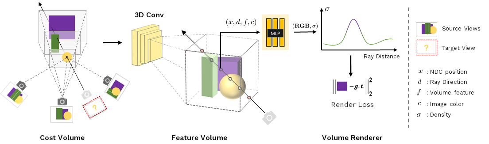

# MVSNeRF
## [Project page](https://apchenstu.github.io/mvsnerf/) |  [Paper](https://arxiv.org/abs/2103.15595)
This repository contains a pytorch lightning implementation for the paper: [MVSNeRF: Fast Generalizable Radiance Field Reconstruction from Multi-View Stereo](https://arxiv.org/abs/1911.11530). Our work present a novel neural rendering approach that can efficiently reconstruct
geometric and neural radiance fields for view synthesis, Moreover, if dense images are captured, our estimated radiance field representation can be easily fine-tuned; this leads to fast per-scene reconstruction.<br><br>



## Installation

#### Tested on Ubuntu 16.04 + Pytorch 1.8 + Pytorch Lignting 1.3.5

Install environment:
```
pip install pytorch-lightning, inplace_abn
pip install imageio, pillow, scikit-image, opencv-python, config-argparse, lpips
```


## Training
Please see each subsection for training on different datasets. Available training datasets:

* [DTU](#dtu)
* [Blender](#blender) (Realistic Synthetic)
* [LLFF](#llff) (Real Forward-Facing)
* [Your own data](#your-own-data) (images/intrinsic/extrinsic/nearfar boundles)

### DTU dataset

#### Data download

Download the preprocessed [DTU training data](https://drive.google.com/file/d/1eDjh-_bxKKnEuz5h-HXS7EDJn59clx6V/view)
and [Depth_raw](https://virutalbuy-public.oss-cn-hangzhou.aliyuncs.com/share/cascade-stereo/CasMVSNet/dtu_data/dtu_train_hr/Depths_raw.zip) from original [MVSNet repo](https://github.com/YoYo000/MVSNet)
and unzip. We provide a [DTU example](https://1drv.ms/u/s!AjyDwSVHuwr8zhAAXh7x5We9czKj?e=oStQ48), please
follow with the example's folder structure.

#### Training model

Run
```
CUDA_VISIBLE_DEVICES=$cuda  python train_mvs_nerf_pl.py \
   --expname $exp_name
   --num_epochs 6
   --use_viewdirs \
   --dataset_name dtu \
   --datadir $DTU_DIR
```
More options refer to the `opt.py`, training command example:
```
CUDA_VISIBLE_DEVICES=0  python train_mvs_nerf_pl.py
    --with_depth  --imgScale_test 1.0 \
    --expname mvs-nerf-is-all-your-need \
    --num_epochs 6 --N_samples 128 --use_viewdirs --batch_size 1024 \
    --dataset_name dtu \
    --datadir path/to/dtu/data \
    --N_vis 6
```

You may need to add `--with_depth` if you want to quantity depth during training. `--N_vis` denotes the validation frequency.
`--imgScale_test` is the downsample ratio during validation, like 0.5. The training process takes about 30h on single RTX 2080Ti
for 6 epochs. 

*Important*: please always set batch_size to 1 when you are trining a genelize model, you can enarge it when fine-tuning.

*Checkpoint*: a pre-trained checkpint is included in `ckpts/mvsnerf-v0.tar`. 

*Evaluation*: We also provide a rendering and quantity scipt  in `renderer.ipynb`, 
and you also can use the run_batch.py if you want to testing or finetuning on different dataset.

Rendering from the trained model should have result like this:


## Finetuning
### Blender
<details>
  <summary>Steps</summary>

#### Data download

Download `nerf_synthetic.zip` from [here](https://drive.google.com/drive/folders/128yBriW1IG_3NJ5Rp7APSTZsJqdJdfc1)

```
CUDA_VISIBLE_DEVICES=0  python train_mvs_nerf_finetuning_pl.py  \
    --dataset_name blender --datadir /path/to/nerf_synthetic/lego \
    --expname lego-ft  --with_rgb_loss  --batch_size 1024  \
    --num_epochs 1 --imgScale_test 1.0 --white_bkgd  --pad 0 \
    --ckpt ./ckpts/mvsnerf-v0.tar --N_vis 1
```

</details>

### LLFF
<details>
  <summary>Steps</summary>


#### Data download

Download `nerf_llff_data.zip` from [here](https://drive.google.com/drive/folders/128yBriW1IG_3NJ5Rp7APSTZsJqdJdfc1)

```
CUDA_VISIBLE_DEVICES=0  python train_mvs_nerf_finetuning_pl.py  \
    --dataset_name llff --datadir /path/to/nerf_llff_data/{scene_name} \
    --expname horns-ft  --with_rgb_loss  --batch_size 1024  \
    --num_epochs 1 --imgScale_test 1.0  --pad 24 \
    --ckpt ./ckpts/mvsnerf-v0.tar --N_vis 1
```

</details>

### DTU
<details>
  <summary>Steps</summary>

```
CUDA_VISIBLE_DEVICES=0  python train_mvs_nerf_finetuning_pl.py  \
    --dataset_name dtu_ft --datadir /path/to/DTU/mvs_training/dtu/scan1 \
    --expname scan1-ft  --with_rgb_loss  --batch_size 1024  \
    --num_epochs 1 --imgScale_test 1.0   --pad 24 \
    --ckpt ./ckpts/mvsnerf-v0.tar --N_vis 1
```

</details>

## Rendering
After training or finetuning, you can render free-viewpoint videos
with the `renderer-video.ipynb`. if you want to use your own data,
please follow the prepare the data (intrinsic, nearfar and extrinsic either with
camera to world or world to camera in opencv format) and modify the rendering scipts.

After 10k iterations (~ 15min), you should have videos like this:


## Citation
If you find our code or paper helps, please consider citing:
```
@article{chen2021mvsnerf,
  title={MVSNeRF: Fast Generalizable Radiance Field Reconstruction from Multi-View Stereo},
  author={Chen, Anpei and Xu, Zexiang and Zhao, Fuqiang and Zhang, Xiaoshuai and Xiang, Fanbo and Yu, Jingyi and Su, Hao},
  journal={arXiv preprint arXiv:2103.15595},
  year={2021}
}
}
```

Big thanks to [**CasMVSNet_pl**](https://github.com/kwea123/CasMVSNet_pl), our code are partially
borrow from them.

## Relevant Works
[**MVSNet: Depth Inference for Unstructured Multi-view Stereo (ECCV 2018)**](https://arxiv.org/abs/1804.02505)<br>
Justus Thies, Michael Zollhöfer, Matthias Nießner

[**Cascade Cost Volume for High-Resolution Multi-View Stereo and Stereo Matching (CVPR 2020)**](https://arxiv.org/abs/1912.06378)<br>
Vincent Sitzmann, Justus Thies, Felix Heide, Matthias Nießner, Gordon Wetzstein, Michael Zollhöfer

[**NeRF: Representing Scenes as Neural Radiance Fields for View Synthesis (ECCV 2020)**](http://www.matthewtancik.com/nerf)<br>
Ben Mildenhall, Pratul P. Srinivasan, Matthew Tancik, Jonathan T. Barron, Ravi Ramamoorthi, Ren Ng

[**IBRNet: Learning Multi-View Image-Based Rendering (CVPR 2021)**](https://ibrnet.github.io/)<br>
Konstantinos Rematas, Vittorio Ferrari

[**PixelNeRF: Neural Radiance Fields from One or Few Images (CVPR 2021)**](https://alexyu.net/pixelnerf/)<br>
Michael Oechsle, Michael Niemeyer, Lars Mescheder, Thilo Strauss, Andreas Geiger